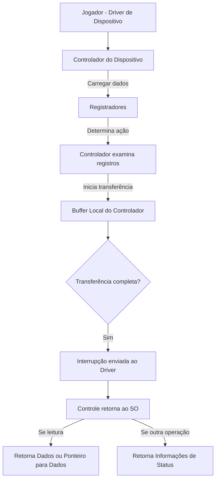
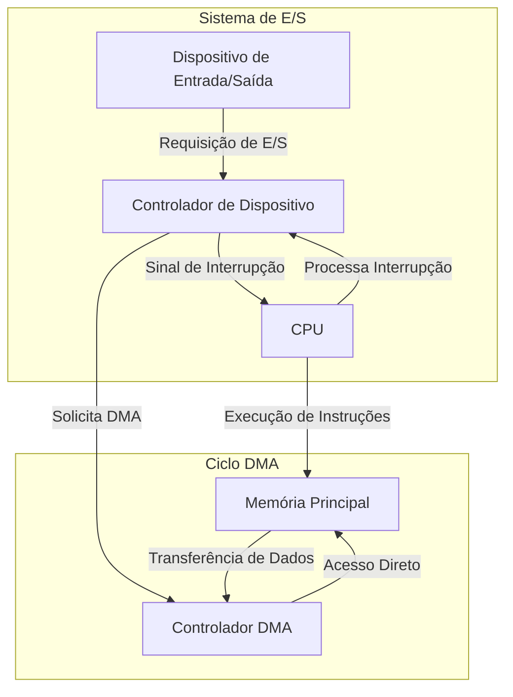
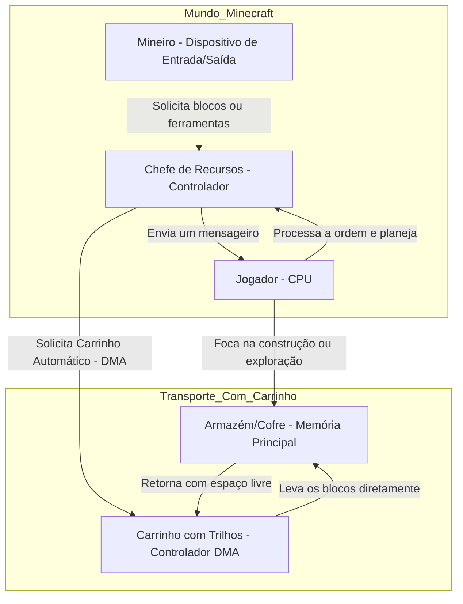

# Estrutura de Entrada e Saída

Os dispositivos de  Entrada e Saída (ou como será usada: E/S), é um dos grandes pontos importantes para um Sistema Operacional, como podemos notar no armazenamento que possui grande importância é sendo um dispositivo de E/S.
- Um outro ponto importante é que grande parte do código do SO é pensado para E/S;
	- Tanto por causa da **confiabilidade** como **desempenho**

> Um sistema computatorizado para uso geral, consiste em:
> - CPU
> - Diversos tipos de controladores de dispositivos conectados por um barramento comum
> Cada controlador possui um tipo especifico de dispositivo

Por exemplo, para o controlador SCSI (Small Computer-System Interface) podemos ter sete ou até mais dispositivos conectados ao mesmo controlador.

Cada controlador armazena **buffer local** e um **conjunto de registradores de uso especial**.

Os controladores tem duas funções básicas, que se baseiam:
- **Move** os dados para os dispositivos periféricos que controla 
- **Gerencia** o uso do buffer local

Tais sistemas possuem um **device driver** (driver de dispositivo) este driver vai servir como ponte entre o dispositivo e o sistema, assim podemos ter que a **entrada dos dispositivo** tenha uma **saída uniforme** para o restante do sistema.

O funcionamento de uma operação de E/S:
- O **driver de dispositivo** por sua vez **carrega** os **registradores** apropriados para dentro do **controlador do dispositivo** 
- O **controlador** **examina** o **conteúdo** que tem nos **registradores**, para determinar que ação deve ser tomada
- O controlador começa a transferir os dados do dispositivo para o seu buffer local
- Assim que a transferência está concluída o **controlador de dispositivo** envia uma **interrupção** para o **driver de dispositivo** informando que a transferência foi concluída 
- O drive de dispositivo então retorna o controle diretamente para o SO retornando os dados ou um ponteiro para esses dados, possivelmente, isto ocorre caso a operação for de leitura
  - Para outras informações o driver retorna informações de estado (status)

***Representação:***

> 🚨 Para pequenas porções de dados está arquitetura de E/S por interrupção funciona bem, mas não trabalhamos somente com isso faz muito tempo, por isso, se usarmos está forma para grandes volumes de dados como E/S de disco gera um **overhead** (que é uma sobrecarga)

Com esse grande problema precisamos então de um outro dispositivo, um que armazene esses dados para que o acesso seja mais rápido, para isso usamos a **DAM** (Direct Access Memory ou Memoria de Acesso Direto) 

Logo o ciclo se torna assim:
- Depois de configurar buffers, ponteiros e contadores o dispositivo de E/S, o controlador de dispositivo **move um bloco inteiro de dados** diretamente para ou do seu próprio buffer local para a memoria.
  - Somente **uma interrupção é feita por bloco**, para que seja avisado ao drive de dispositivo que a **transferência foi concluída**

> Nesta etapa de transferência direta não ocorre intervenção da CPU, assim apenas o controlador de dispositivo cuida dessa tarefa

Para alguns sistemas não é utilizado essa arquitetura de barramento e sim de switch
- Nesse tipo de sistema os vários componentes do sistema podem interagir entre si ao mesmo tempo
- Ao invés de competir por ciclos de um barramento compartilhado
- Assim o **DMA** consegue ser ainda mais eficiente

***Representação da interação dos componentes num sistema:***

- ***Com Mine:***

