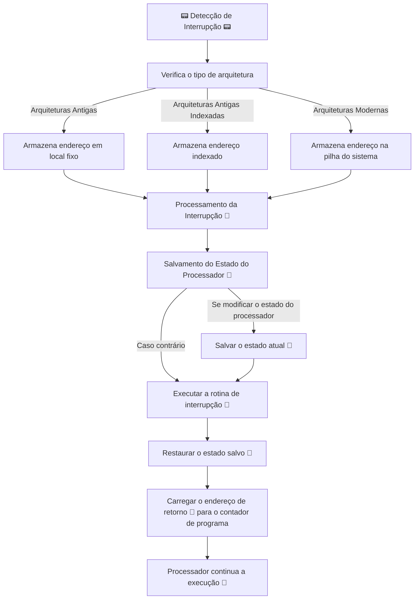
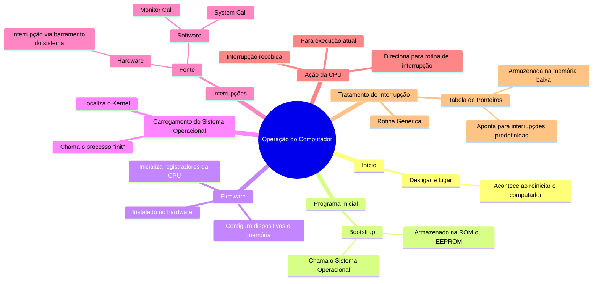

# Operação do computador

Ao desligar o computador e ligar, o que será que acontece? Como ele "chama" o Sistema Operacional.

Para  o  computador começar a funcionar ele chama um programa básico, chamado de **bootstrap** normalmente está alocado na memoria apenas de leitura (**ROM**) ou então é salva na memoria de somente leitura apagável programavelmente **EEPROM**.

Esse programa é conhecido como **Firmware** porque está instalado diretamente no hardware, assim ele inicializa todos os aspectos do sistema que vão dos registradores da CPU até a dispositivos e conteúdo na memoria.

Para carregar o SO ele precisa localizar o **Kernel** que é o núcleo do sistema operacional, assim que carregado na memoria do computador ele chama um processo chamado **init** que espera uma interrupção do sistema ou do hardware, os dois casos:
- Se for pelo hardware, ele manda uma interrupção por sinal para a CPU, via normalmente barramento do sistema;
- Se for por software, ele pode fazer de duas maneiras ou chamando o **system call** (chamada do sistema) ou usando o **monitor call** (monitor de chamada) elas são operações especiais executadas para realizar a interrupção disparando um sinal para a CPU.

Assim que a CPU  recebe alguma interrupção ela para o que está fazendo:


E a CPU manda a execução para uma **locação fixa de memoria**, tal locação contem o **endereço inicial** que está localizada a rotina para **atender a essa interrupção.**

Essas **interrupções** podem ser tratadas de diferentes  maneiras e cada computador possui seu próprio mecanismo. Um método simples para isso, seria tratar a transferência chamando uma rotina generica.

Para dar mais enfoque em velocidade pode ser usada uma **tabela de ponteiros a pontando para as interrupções**, já que elas devem ser predefinidas. **Essa tabela é armazenada em memoria baixa**, sendo ela a primeira parte ou locação da memoria.

Esse **vetor de interrupção** vai ser indexado exclusivamente pelo número do dispositivo, fornecido com a requisição da interrupção para gerar o endereço do tratamento da interrupção:

```
┌───────────────────────────────────────────────┐
│                  Interrupção 🔔               
└───────────────────────────────────────────────┘
   ┌───────────────────────────────────────────┐
   │     CPU manda execução para local         
   │      fixo na 💾, com endereço da          
   │     rotina de tratamento. 🏃‍♂️              
   └───────────────────────────────────────────┘
        ┌───────────────────────────────┐
        │  Diferentes formas de tratar  
        │   interrupções, cada 🖥️       
        │   com seu próprio jeito.     
        └───────────────────────────────┘
             ┌───────────────────────┐
             │    Método simples:    
             │  Transfere para uma   
             │   rotina genérica. 🔁 bootsrap
             └───────────────────────┘
                  ┌───────────────────────┐
                  │   Método rápido:      
                  │  📋 Tabela de         
                  │  ponteiros para       
                  │  interrupções, em     
                  │  memória baixa. 🔽    
                  └───────────────────────┘
                       ┌───────────────────┐
                       │  📋 Vetor usa     
                       │ 📟 dispositivo    
                       │ para gerar        
                       │ endereço do       
                       │ tratamento. 🔍    
                       └───────────────────┘
```

A arquitetura de interrupção **precisa salvar o endereço da instrução interrompida**, em projetos:
- Em alguns antigos armazenam o endereço da interrupção de **maneira fixa ou local indexado** por um numero do dispositivo;
- Em arquiteturas modernas, eles armazenam em **pilhas do sistema**;

Se a rotina de interrupção precisar modificar algum estado do processador, por exemplo alterando os valores do **registrador**:
- Ela vai **salvar** o estado atual, explicitamente;
- Depois **carregar** e **restaurar** esse estado para depois **retornar**;
- Em seguida será carregado para o **contador de programa** o **endereço do retorno** e o **processador** que foi **interrompido** continua como se nada tivesse acontecido:




## Diagrama


