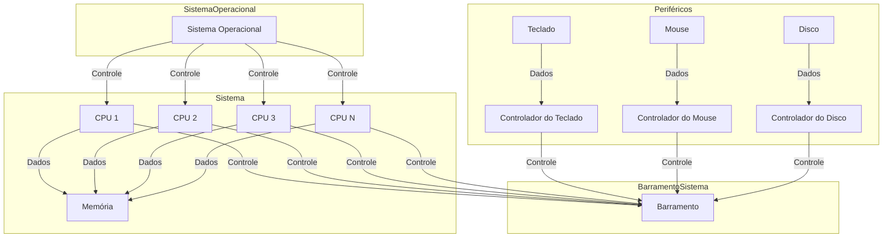

# 1.3 Arquitetura do Sistema

Agora falaremos sobre a categorização dos sistemas computadorizados, que é feita com base no número de processadores que ele possui, ou seja, estamos nos referindo a computadores de uso geral.

## Sistema Monoprocessador

Esses sistemas, como o nome diz, possuem um único processador e foram muito utilizados, desde PDAs até mainframes. Assim, esses sistemas contêm uma única CPU que pode realizar diversas instruções de uso geral, assim como os processos do usuário.

> A maioria dos sistemas utiliza um processador de uso específico, como, por exemplo, para processamento gráfico, com os controladores gráficos, ou nos mainframes, com os processadores de E/S.  
{style="note"}

Esses processadores específicos não executam processos do usuário e somente realizam instruções limitadas e especializadas.

- Em alguns casos, o sistema operacional controla esse componente, pois o sistema envia informações sobre sua próxima tarefa e monitora seu status.

### Exemplo:
- Um processador controlador de disco recebe uma sequência de requisições da CPU principal.
- Implementa sua própria fila de disco e algoritmo de escalonamento.

> Com isso, há um alívio na carga de processamento do escalonamento de disco, que, de outra forma, seria delegado à CPU principal.  
{style="note"}

O sistema operacional não pode se comunicar diretamente com esses processadores, pois eles operam em um nível mais baixo. Um exemplo disso são os teclados, que possuem um microprocessador responsável por converter os toques nas teclas em códigos que serão enviados para a CPU principal. 

Assim, esses processadores realizam suas tarefas de forma anônima, pois não interagem diretamente com o sistema operacional.

Mesmo com o uso desses processadores específicos, o sistema ainda não é considerado multiprocessado. 

Para que um sistema seja classificado como monoprocessador, ele deve possuir uma única CPU de uso geral. Os processadores mencionados anteriormente são de uso específico.

### Diagrama

 
 

## Sistema multi-processador
Esse tipo de sistema em que temos mais de um processador, de uso geral, dentro de um mesmo sistema computadorizado tem ganhado cada vez mais espaço por diversas razões o lugar dos sistema mono processador.

Os sistemas multiprocessados, ou também conhecidos como: **sistemas paralelos** (parallel system) ou **sistema fortemente acoplado** (tightly coupled system) fazem um compartilhamento perfeito de periféricos, relógio do computador, barramento do computador para vários processadores de modo que a comunicação entre eles é perfeita.

Podemos escalar **três grandes vantagens** a cerca desse tipo de arquitetura para sistemas:
- Maior vazão:
- Economia de escala:
- Maior confiabilidade:

---
