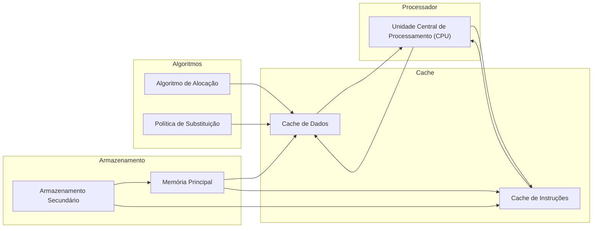
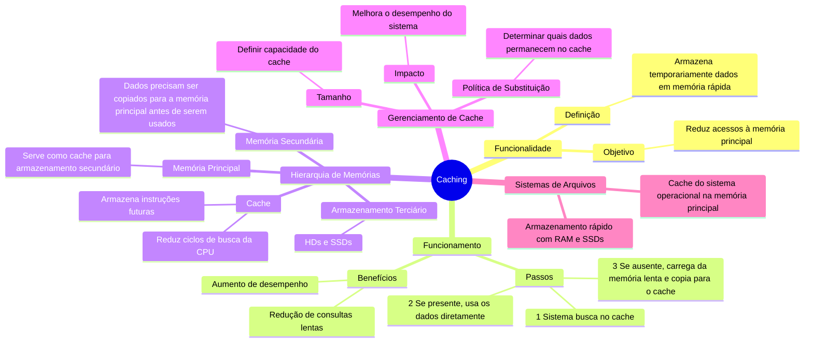
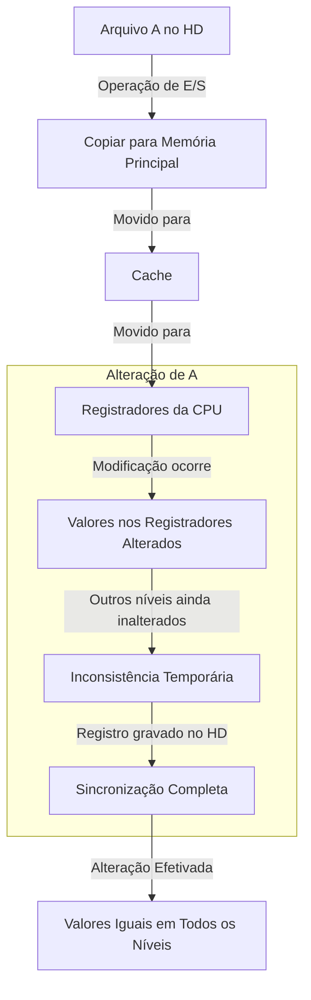

# Caching

O entendimento de **caching** é fundamental para compreender como os sistemas computadorizados funcionam.

Primeiro, pensemos que as **informações são armazenadas** em algum **dispositivo de armazenamento**, como a memória principal. Conforme são utilizadas, essas informações **são copiadas para uma memória mais rápida de modo temporário** (até mesmo mais rápida que a memória principal). Essa memória é o ***cache***.

## Como funciona?

**Primeiro**, ao precisarmos de alguma informação, **o sistema busca no cache**:
- Se a informação estiver disponível, **usamos os dados dali mesmo**.
- Caso não esteja, **o sistema irá carregá-la de uma memória mais lenta** (principal ou até mesmo de massa, secundária) e, em seguida, **fará a cópia temporária para o cache**.
	- Dessa forma, em uma **nova tentativa de acesso ao dado, ele poderá ser encontrado no cache**, reduzindo significativamente as consultas lentas que seriam feitas à memória principal.

Indo além, registradores responsáveis pela comunicação com a memória principal, como registradores de índice, **são gerenciados por um algoritmo de alocação e substituição de registradores, implementado pelo programador ou compilador**.

Esses **algoritmos** definem **quais informações serão mantidas nos registradores** e quais **serão enviadas para a memória principal**.

Também existem hardwares projetados para **serem implementados inteiramente no hardware**.

A maioria dos sistemas possui um **cache de instruções**, que serve para **armazenar as próximas instruções a serem executadas**.

**Sem isso, a CPU** levaria **vários ciclos** para buscar na memória principal a **próxima instrução a ser executada**.

Por essa e outras razões, a maioria dos sistemas possui vários caches de dados de alta velocidade, que estão no **topo da Hierarquia de Memórias**.

Mas, como os caches possuem um **tamanho reduzido**, o **gerenciamento de cache** se torna **fundamental**. Esse gerenciamento envolve alguns aspectos importantes, como:
- Definir o **tamanho do cache**.
- Estabelecer a **política de substituição**.

Esses fatores podem **melhorar o desempenho da memória cache**.

A **memória principal** pode ser vista como um **cache rápido para o armazenamento secundário**, pois os dados precisam ser copiados da memória secundária para a principal antes de serem utilizados.

De forma recíproca, para serem **movidos para a memória secundária**, os dados **precisam estar primeiro na memória principal**, garantindo proteção e integridade.

O sistema de arquivos vê os dados permanentemente gravados no armazenamento secundário de forma hierárquica, existindo *diversos níveis na hierarquia*:
- No nível mais alto -> o **sistema operacional** pode **manter um cache do sistema de arquivos na memória principal**.

Também é **possível que memórias RAM, como discos de estado sólido** (ou então discos eletrônicos de RAM), sejam usadas para **armazenamento de alta velocidade**, acessados pela **interface do sistema de arquivos**. Isso significa que a comunicação deve ser feita diretamente com o sistema de arquivos.

Atualmente, a maior parte do **armazenamento terciário** consiste em **HDs ou SSDs**.

### Diagrama {id="diagrama_2"}

## Níveis e o Cache

Os **movimentos** de informações entre os **níveis da hierarquia de memórias** podem ser de dois tipos: **explícitos** e **implícitos**. Isso depende da arquitetura do **hardware** e do **software** que controla o sistema operacional.

Podemos exemplificar essa questão:
- A **transferência de dados entre a cache e a CPU e seus registradores** -> ocorre diretamente no **hardware**, sem intervenção do sistema operacional.
- A **transferência de dados do disco para a memória RAM** -> normalmente é controlada pelo **sistema operacional**.

Como, nessa estrutura hierárquica, os mesmos dados podem aparecer em diferentes níveis de armazenamento, vejamos um exemplo:

- Suponha que um texto no arquivo `A` precise ser alterado para um outro valor no arquivo `B`, que reside no HD.
- Antes da alteração, **o sistema precisa emitir uma operação de E/S para copiar o bloco de disco contendo `A` para a memória principal**.
- Em seguida, o arquivo `A` será **copiado para o cache e para os registradores internos da CPU**.
- Assim, a **cópia de `A` estará presente em vários níveis**, conforme mostrado abaixo:

- Quando a alteração for feita nos registradores internos da CPU, os valores de `A` **serão diferentes nos outros níveis de armazenamento, que permanecerão inalterados**.
- Somente quando o **registrador gravar a mudança no disco rígido** (memória secundária), os valores nos diferentes níveis estarão **sincronizados**, tornando a alteração efetiva.

#### Diagrama {id="diagrama_1"}

## Threads, Cores e Sistemas Distribuídos

Em um ambiente com **apenas uma thread** (executando uma única tarefa por vez), esse esquema hierárquico funciona perfeitamente. Quando um valor é alterado nos registradores ou acessado no disco, o fluxo ocorre de forma linear, do nível mais alto ao mais baixo, sem conflitos de dados, pois todos os níveis são atualizados sequencialmente.

Entretanto, em **sistemas multicore**, onde múltiplas threads acessam simultaneamente o mesmo arquivo `A`, é necessário um **mecanismo de controle** para garantir que todos os núcleos acessem os valores atualizados de `A`. Caso contrário, podem ocorrer inconsistências, onde diferentes threads terão versões diferentes do mesmo dado, causando falhas no sistema.

Esse problema se torna ainda mais crítico em **sistemas multiprocessadores**, pois, além de registradores internos, cada processador pode possuir caches locais distintos.

Assim, `A` pode existir em diversos caches simultaneamente, e é essencial que a **versão mais recente de `A` seja refletida em todos os núcleos**.

- Esse problema é conhecido como **Coerência de Cache**, e sua solução ocorre em **baixo nível**, diretamente no hardware.

A complexidade aumenta ainda mais em **sistemas distribuídos**, onde diversas cópias de `A` podem estar espalhadas por vários computadores conectados em rede.

Para evitar inconsistências, o sistema precisa garantir que **as alterações no arquivo sejam refletidas nas demais máquinas o mais rapidamente possível**.

- Existem diversas estratégias para resolver esse problema de sincronização em sistemas distribuídos.

### Diagrama

```mermaid
graph TD;
    A[Single Thread] -->|Execução Linear| B[Níveis Atualizados Sequencialmente];
    
    subgraph Multicore
        C[Múltiplas Threads] -->|Acessam o mesmo arquivo| D[Possível Inconsistência de Dados];
        D -->|Mecanismo de Controle| E[Acessar Versões Atualizadas]
    end
    
    subgraph Multiprocessadores
        F[Registradores Internos] --> G[Caches Locais Distintos];
        G -->|A pode estar em múltiplos caches| H[Problema de Coerência de Cache];
        H -->|Solução de Baixo Nível| I[Sincronização pelo Hardware]
    end
    
    subgraph Sistemas Distribuídos
        J[Cópias de A em Múltiplas Máquinas] --> K[Risco de Inconsistência];
        K -->|Garantia de Sincronização| L[Alterações Refletidas Globalmente]
    end
```

