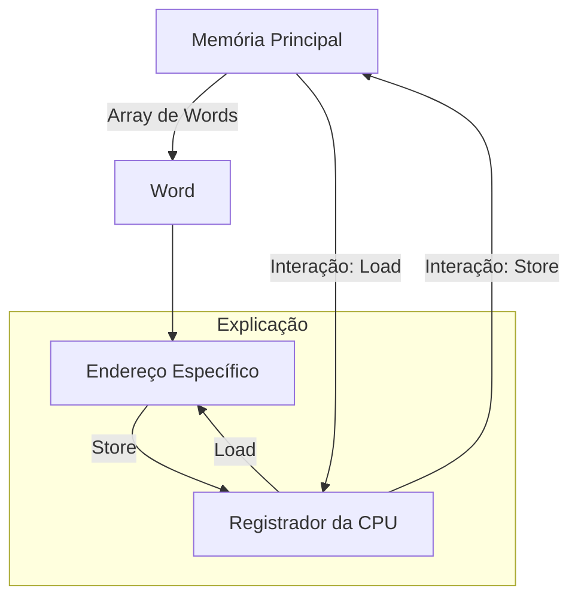
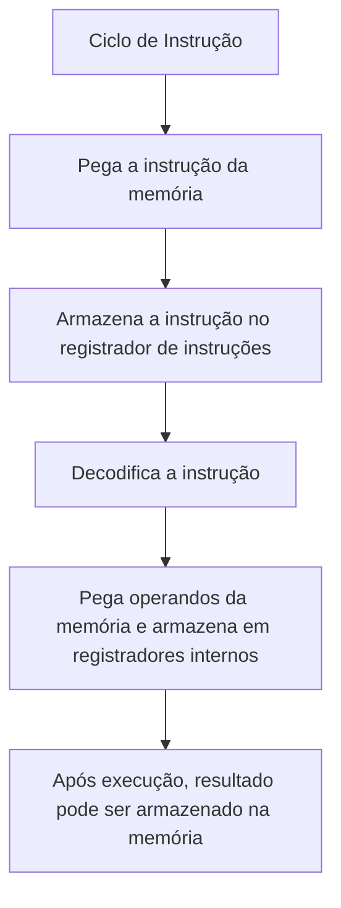
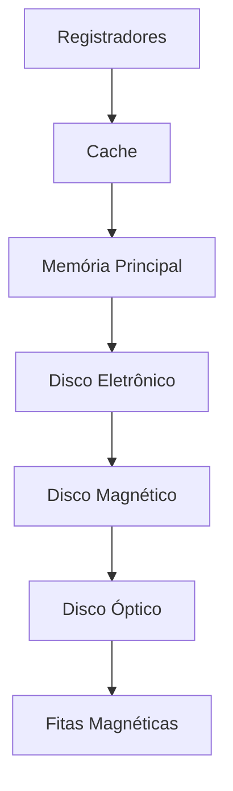

# Estrutura de Armazenamento

Para os computadores que temos a **CPU** só consegue carregar instruções que vem diretamente da memoria.
- Está memoria não sendo qualquer uma e sim a **Memoria Principal** - aquela cujo acesso é randômico ou seja desligou o PC o que estava armazenado é apagado está é a memoria **RAM**.

> 🔗 Veja mais sobre tipos de memoria em: [[05 - Types of Memory]]

A memoria RAM é comumente feita numa arquitetura de semicondutores chamada de **Dynamic Random Access Memory** (DRAM) ou em *pt-BR*, **memoria de acesso dinâmica**.

Um outro tipo de memoria é aquela que só serve para leitura, assim como a mulher do seu amigo, apenas olhe. As conhecidas são: 
- **ROM** (Read Only Memory) ==> normalmente vem nos computadores e é usado para armazenar o programa bootstrap
	- Além disso é usado por empresas de jogos para guardar os jogos, já que ela possui essa natureza imutável
- **EEPROM** (Electrically Erasable Programmable Read Only Memory) 
	- Por não ser modificado com frequência esta memoria costuma ser usada para armazenar programas padrões de modo estáticos 
		- Smartphones por exemplo utilizam a EEPROM de modo que as fabricantes armazenam nela os aplicativos de fábrica

Quaisquer destas memorias utilizam **um array de words** ou uma **unidades de armazenamento**.
- Cada *word* possui seu próprio endereço 
- As interações se dão por instruções:
	- `load`  - vai **carregar** um endereço especifico da **memoria principal** para um dos **registradores** da CPU
	- `store` - move um conteúdo de um **registrador da CPU** para a **memoria principal**

*Ilustração de um esquema sobre instruções da CPU (`load` e  `store`)*

> 💡 A CPU carrega e armazena essas instruções tanto explicitamente (dizer para ela fazer) como de maneira automática - ela faz sozinha O carregamento da memoria principal para serem executadas;

A arquitetura mais usada nos computadores modernos é a de **Von Neumann**. Está arquitetura funciona deste modo:
- Programas e dados são armazenados na memoria principal
- A CPU gerencia a memoria principal

Vamos para um ciclo de execução - quando uma instrução é dada:
1. Pega a instrução da memoria 
2. Armazena essa instrução no **registrador de instruções**
3. Essa instrução é então decodificada
	1. Pode pegar operandos da memoria e armazenar em registradores internos
4. Após a execução dos operandos o resultado pode ser armazenado na memoria

***Diagramas de Execução de Instrução***

> ![[003 - Estrutura de Armazenamento.png]]

> 💡 A unidade de memoria só consegue ver um fluxo de endereços de memoria. Ela não sabe: 
> - Como são gerados ou
>  - Gerados por contador de instruções, indexação, endereços literais e etc 
> - Para que servem
>  - Se são instruções ou dados

Seria bom, mas a vida não é um morango, a memoria principal guardar todos os dados  e programas entretanto, todavia, não temos isso já que:
- **A memoria principal é volátil**, vai perder os dados assim que a maquina desligar;
- A memoria principal possui um **armazenamento irrisoriamente pequeno** para que seja possível armazenar todos os programas e dados;

Assim precisamos de outro tipo de memoria que é a **chamada memoria secundaria**, aquela com o proposito de possuir **armazenamento em massa** (guardar muitos dados) e **ser permanente**. 

Um bom exemplo de memoria secundaria é o HD (Disco Rigido) e também temos outro tipo que é a que está mais se popularizando no mercado que é o SSD (Disco de Estado Sólido).

Porém, não temos só isso de dispositivos e podemos fazer uma hierarquia dessses dispositivos que será assim:

***Diagramas de Dispositivos de Armazenamento:***

![[003 - Estrutura de Armazenamento-Hierarquia-Dispositivos-De-Armazenamento.png]]

---

[[002 - Operação do computador]]

[[004 - Estrutura de IO]]
