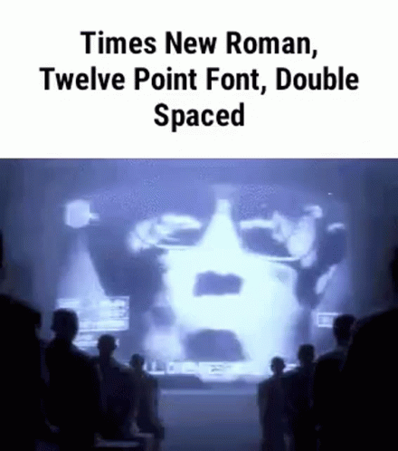

# Pré-Cálculo

## Intro
O calculo nasceu para resolver questões que a matemática não conseguia resolver.

## Parte 1 - Senta que lavem história

>![[the-simpsons-homer.gif]]

A invenção do calculo se deu como uma grande ferramenta para resolver os problemas que os matemáticos sempre criam e problemas que ainda nem se vinham a aurora de seus dias. 

Essas questões que se tinham se enebriava nas mentes dos matemáticos por 2.000 anos.

> Devo ser muito matemático, nem se eu tivesse todo esse tempo esqueceria minha ex
> 
> ![[noite-carioca-noite.gif]]

### Um pouco sobre o Cálculo
> ![[calculation-math.gif]]

De antemão o que *caralinhos* significa cálculo, preste atenção que tudo tem um significado e ele é sempre criado. Ok, mas o porque de terem criado então? 

O cálculo gera uma **maneira de medir taxas de mudanças e seus efeitos**.

> Cálculo = Calculus --> vem do latim, que é de uma pedra usada para contagem
> **Modo ironia:** Era como os antigos traficantes contavam a pedra
> ![[Pre-Calculo - rockmeme.png]]
> Fonte: https://www.reddit.com/r/mathmemes/comments/143d70s/calculus_is_the_latin_word_for_pebble_our/

O cálculo é uma moeda de duas faces, onde temos uma que é a diferenciação e a integração.
- Tomemos que a integral ela é um grau superior da equação, ou seja, a integral do leite é a própria vaga.
- Agora ao fazermos a diferenciação para obter a derivada do leite o que temos é seus derivados como queijo

![[Pre-Calculo-integral-derivada-exe.png]]

> 💡 Uma é o inverso da outra

Assim aplicando o *teorema fundamental do cálculo* é que aplica a diferenciação em uma integral para retornar a expressão original e vice-versa, ou seja, uma via de mão dupla.

> 📝 Os dois métodos se voltam a ser para aproximação, mas procuram usar ***limites*** que fazem o *erro envolvido* (isto é a imprecisão da aproximação) tender a zero.

Os fundamentos do cálculo se deram aos trabalhos de Isaac Newton, isso por volta de 1670 e não foi só Newton, mas também tiveram os trabalhos do polimatematico Gottfried Leibniz.

> Sim, a maquina, o homem, o iluminado, o Isaacgol
> ![[isaac1.gif]]

Esses dois grande cientistas na época brigaram muito, pelas glorias (prioridade e méritos) a cerca de suas descobertas, tal que acabou isolando os matemáticos britânicos até o seculo 19.

>![[mio-mio-isaac-newton.gif]]

### Impacto do cálculo
> ![[galaxy-impact-genshin-impact.gif]]

Para **calcular a velocidade de um corpo em um determinado instante no tempo** o **Cálculo Diferencial** **serviria muito bem**. 

Inclusive ao estudar a queda dos corpos Galileu precisava calcular a velocidade de um objeto em um determinado ponto no tempo, ele poderia usar  o cálculo. 

Claro que isso não foi possível já que Galileu morreu no mesmo ano que Newton nasceu, talvez ele tenha até reencarnado.

> ![[reborn-im-reborn.gif]]

Assim o cálculo gerou um **novo ramo na matemática chamado de "analise"** que se propõe a se debruçar a mudança continua.

A diferenciação tanto pode ser usada para a modelagem de doenças epidêmicas omo na determinação do caminho que um avião precisa percorrer para não colidir com duas torres.

### Fechando a primeira parte
De forma geral, isso foi um infinitesimal sobre o contexto histórico e a importância do calculo.

---

## Parte 2 - Taca-lhe pau nesse carrinho marcos
> ![[carrinho-marcos-tacalhe-pau.gif]]

### Começo
Como foi dito, o calculo vai se adentrar em resolver problemas que a matemática não consegue. Vamos a exemplos:

Neste exemplo, para calcular a área de um triangulo, o **cálculo se torna desnecessario**, a matematica consegue resolver sem problemas.
![[Pre-Calculo-ex1mat.png]]

Agora para calcular a área desses gráficos, **o cálculo se torna essencial**:
1. ![[Pre-Calculo- exemplo1calculo.png]]

2. ![[Pre-Calculo-exemplo2calculo.png]]

3. ![[Pre-Calculo-exemplo-calculo3.png]]

#### Tornando um pouco mais real
Vamos a um exemplo da vida real onde está aprendendo a dirigir:
1. Este foi o gráfico com um olhar da matemática:
![[Pre-Calculo-grafico-olhar-matematica.png]]
2. Este é o gráfico real:
![[Pre-Calculo-grafico-vida-real.png]]

Com isso, o calculo ela vai fazer uma quebra do gráfico e ver apenas pequenas partes, parcelas pequenas no gráfico e fazer a junção do todo. Sendo que o processo seria o seguinte:
1. Cortar uma parte do gráfico e assim temos uma reta
2. Trabalhar em cima dessa reta
3. Juntar tudo
![[Pre-Calculo-comocalculofaz.png]]

>💡 No cálculo quebramos para trabalhar no final com retas

---
### Potenciação

![[Pre-Calculo-potenciaçao-simbologia.png]]

#### Entendendo conceitos
A potência é a multiplicação de uma determinada base (a) feita n vezes (expoente).
![[Pre-Calculo-potencia-formagatinhos-1.png]]
![[Pre-Calculo-potencia-formamat1.png]]

#### Propriedades

##### Produto de Potências:
Quando temos uma multiplicação de uma **potência de mesma base**, devemos:
1. Manter a base
2. Somar os expoentes
![[Pre-Calculo-potencia-prop-produto-1.png]]
Isso se dá porque ao multiplicarmos:
- Basta apenas quebrar as potências e 
- Assim podemos escrever o resultado disso em uma nova potência 
- Cujo o expoente é a soma dos expoentes das potências anteriores
![[Pre-Calculo-prop-potencia-produto.png]]

##### Divisão de Pôtencias:
Quando temos uma divisão de uma **potência de mesma base**, devemos:
1. Manter a base
2. Subtrair os expoentes
![[Pre-Calculo-potencia-prop-divisao1.png]]
Isso se dá porque ao multiplicarmos:
- Basta apenas quebrar as potências e 
- Assim podemos escrever o resultado disso em uma nova potência 
- Cujo o expoente é a subtração dos expoentes das potências anteriores, já que ao simplificarmos a divisão obtemos isso
![[Pre-Calculo-potencia-prop-divisao.png]]

##### Exercícios
1. $$\frac{3⁵ . 3²}{3⁴} $$
**Solução:**
- Resolvemos a parte de cima:
$$3⁵.3² = 3^{5+2} = 3^{7}$$
- Agora resolvemos a divisão:
$$\frac{3⁷}{3⁴} = 3^{7-4} = 3³ = 27$$
2. $$(-5)²$$
**Solução:**
$$(-5) . (-5) = 25$$
3. $$-5²$$
**Solução:**
$$(5) . (5) = -25$$
> 📝 Todo número negativo elevado a um número par resulta em um número positivo
> 📝 De contra partida, todo número negativo elevado a um número impar resulta em um número negativo
>
> **❗Lembre-se que:** $(-5)²$ é diferente de $-5²$ ou $-(5²)$ ou $-(5)²$
> - No primeiro elevamos o número e o sinal
> - Nos outros três elevamos apenas o número, logo o resultado muda
 
##### Potência de potência:
Quando temos uma **potencia de uma potência**, devemos:
1. Manter a base
2. Multiplicar os expoentes
![[Pre-Calculo-potencia-prop-potencia-de-potencia1.png]]
Isso se dá porque ao multiplicarmos:
- Basta apenas manter a base
- Fazer a potencia dos parenteses 
- Assim podemos fazer a  potencia que sobrou  
- Logo o que temos é o expoente que pode ser obtido fazendo a multiplicação dos expoentes das potências anteriores
![[Pre-Calculo-potencia-prop-potencia-de-potencia.png]]

##### Expoente 0:
Quando temos um **expoente 0**, devemos:
- Colocar como resultado sempre 1
![[Pre-Calculo-pot-prop-expoente0.png]]
Isso se dá porque ao dividirmos um número por ele mesmo o resultado sempre é 1:
- Só que podemos expressar esse número por uma potencia
- Logo, teremos uma divisão de potências e podemos a aplicar a respectiva propriedade
- Assim temos que todo número elevado a zero resulta sempre em 1
![[Pre-Calculo-potencia-prop-expoente01.png]]

##### Expoente Negativo:
Quando temos um **expoente negativo**, devemos:
- Fazer o inverso do número e do expoente, ou seja: 
	- O que está em baixo fica em cima 
	- E o que está em cima fica em baixo
- Depois disso elevamos a fração pelo mesmo que agora é positivo
- Assim temos toda a fração elevada pelo expoente
![[Pre-Calculo-potenciacao-prop-expoente-negativo.png]]
Vendo de outra forma temos:
![[Pre-Calculo-potencia-prop-expoentenegativo-1.png]]

##### Exercícios
1. $$(5³)²$$
**Solução:**
$$5^{3.2} = 5⁵ = 3125$$

2. $$5³^{2}$$
**Solução:**
$$5³^{2} = 5⁹ = 1953125$$

> **❗Lembre-se que:** $(5³)²$ é diferente de $5³^{2}$
> - No primeiro elevamos o número e o expoente
> - Nos outros três elevamos apenas o expoente

3. $$\frac{(5³)² . 5³^{2}}{(5⁵)²}$$
**Solução:**
- Resolvemos a parte de cima:
$$(5³)² = 5^{3.2} = 5^{6}$$
$$5³^{2} = 5⁹$$
$$(5³)² . 5³^{2} = 5⁶ . 5⁹ = 5^{15}$$
- Voltando a original:
$$\frac{(5³)² . 5³^{2}}{(5⁵)²} = \frac{5^{15}}{5^{10}} = 5^{15 - 10} = 5⁵ = 3125$$

3. $$(9^{-1})^{2} . 81$$
**Solução:**
$$9^{-1 . 2} . 81 = 9^{-2} . 9^{2} = 9^{-2 + 2} = 9^{0}$$

##### Raiz para Potência:
Quando temos uma **raiz e queremos transformar em potência**, devemos:
- Mantem a base
- Faz um expoente fracionário, onde:
	- O expoente inicial ficará em cima da fração
	- O índice da raiz ficará em baixo da fração
![[Pre-Calculo-potencia-prop-raiz-para-pot1.png]]
Nisso teremos:
![[Pre-Calculo-potencia-prop-raiz-para-pot.png]]

##### Separar potências:
Quando temos uma **potência com mais de um valor, podemos separa-las**, devemos:
- Manter as bases
- Manter a operação entre os dois valores
- Tornar cada valor uma potência com o expoente inicial
Nessa propriedade temos duas sub propriedades.
###### Não sendo fração:
![[Pre-Calculo-potencia-prop-separar1-1.png]]
![[Pre-Calculo-potencia-prop-separar1-2.png]]
###### Sendo fração:
![[Pre-Calculo-potencia-separar-2-1.png]]
![[Pre-Calculo-potencia-prop-separar-2-2.png]]

##### Exercício
1. Deixe em uma unica fração:
$$\frac{25 . \sqrt{ 5 }}{\sqrt[3]{5}}$$
**Solução:**
- Jogar tudo para potência:
$$25 = 5^{2}$$
$$\sqrt{ 5 } = 5^{\frac{1}{2}}$$
$$\sqrt[3]{ 5 } = 5^{\frac{1}{3}}$$
- Tratar as potências de cima:
$$5^{2} . 5^{\frac{1}{2}} = 5^{2 + \frac{1}{2}}$$
- Voltar a original:
$$\frac{5^{2 + \frac{1}{2}}}{5^{\frac{1}{3}}}$$
- Aplicar a respectiva propriedade:
$$5^{2 + \frac{1}{2} - \frac{1}{3}}$$
$$5^{\frac{12 + 3 - 2}{6}} = 5^{\frac{13}{6}}$$

2. $$[\frac{(a b)^{5}}{a^{6}b^{3}}]^{-1}$$
**Solução:**
- Resolver a parte de cima:
$$[\frac{a^{5} b^{5}}{a^{6}b^{3}}]^{-1}$$
- Aplicar as respectivas propriedades:
$$[\frac{a^{5} b^{5}}{a^{6}b^{3}}]^{-1} = [a^{5-6}b^{5-3}]^{-1} = [a^{-1}b^{2}]^{-1}$$

$$[(\frac{1}{a})^{1}b^{2}]^{-1} = [\frac{1}{a}\frac{b^{2}}{1}]^{-1} = [\frac{b^{2}}{a}]^{-1}$$
$$[\frac{a}{b^{2}}]^{1} = \frac{a}{b^{2}}$$

---
## Links:
> Fonte Arial 12
> 
> 
