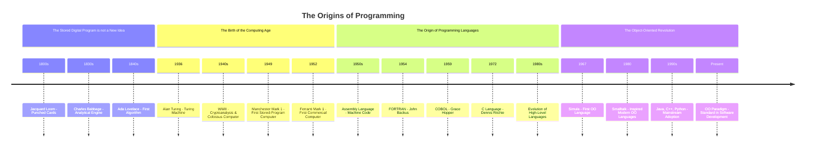

# POO

## Introdução

```mermaid
timeline
  title The Origins of Programming
  section The Stored Digital Program is not a New Idea
    1800s : Jacquard Loom - Punched Cards
    1830s : Charles Babbage - Analytical Engine
    1840s : Ada Lovelace - First Algorithm
  section The Birth of the Computing Age
    1936 : Alan Turing - Turing Machine
    1940s : WWII - Cryptoanalysis & Colossus Computer
    1949 : Manchester Mark 1 - First Stored-Program Computer
    1952 : Ferranti Mark 1 - First Commercial Computer
  section The Origin of Programming Languages
    1950s : Assembly Language - Machine Code
    1954 : FORTRAN - John Backus
    1959 : COBOL - Grace Hopper
    1972 : C Language - Dennis Ritchie
    1980s : Evolution of High-Level Languages
  section The Object-Oriented Revolution
    1967 : Simula - First OO Language
    1980 : Smalltalk - Inspired Modern OO Languages
    1990s : Java, C++, Python - Mainstream Adoption
    Present : OO Paradigm - Standard in Software Development
```